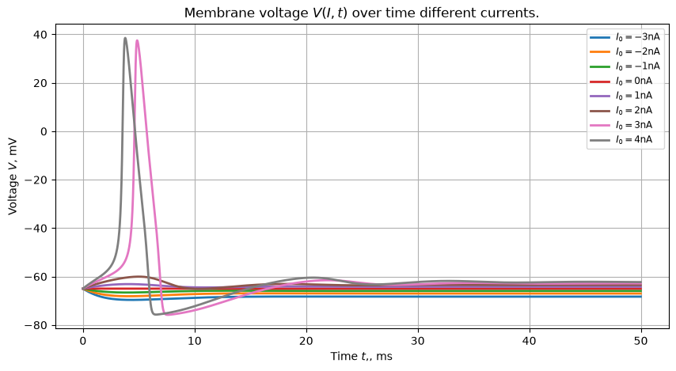
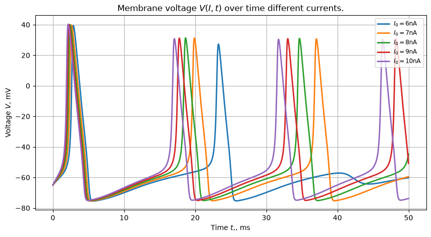
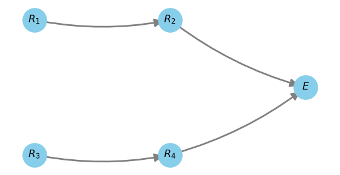
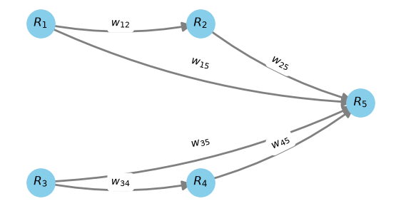

This is a rewritten project from my computational physics course for demonstration purpose. The topic of the project is chess board recognition using the Hodgkin-Huxley model for neurons. Shortly said, the model describes the membrane voltage of neuron with a system of differential equations. The voltage depends on membrane capacity $C_m$, outer current $I_{ext}$, currents $I_{Na}$, $I_K$ from Na and K ions inside and outside the membrane, leak current $I_L$: $$ C_m \frac{dV}{dt} = I_{\mathrm{ext}} - I_{Na} - I_{Ka} - I_{L} = g_{\mathrm{Na}}m^3h(V-E_{\mathrm{Na}}) - g_{\mathrm{K}}n^4(V-E_{\mathrm{K}}) - g_{\mathrm{L}}(V-E_{\mathrm{L}}) = f_{V}(V,n,m,h,t) $$ $$ \frac{dn}{dt} = \alpha_n(V)(1-n) - \beta_n(V)n = f_{n}(V,n,m,h,t) $$ $$ \frac{dm}{dt} = \alpha_m(V)(1-m) - \beta_m(V)m = f_{m}(V,n,m,h,t) $$ $$ \frac{dh}{dt} = \alpha_h(V)(1-h) - \beta_h(V)h = f_{h}(V,n,m,h,t) $$ or in short form it can be written with state vector $\vec{s}$: $$ \vec{s}(t) := (V, n, m , h, t)^T $$ $$ \frac{d\vec{s}}{dt} = F(V,n,m,h,t) := (f_v, f_n, f_m, f_h, t)^T $$ There is no analytical solution for this system and we use Runge-Kutta method of grade 4 for calculations. For example, this is membrane voltage over time for different constant current:   As we see different currents cause different voltage dynamics. We will use this property later, when we will set different outer currents for white and black pixels. The second important property of current in physiological neurons is how voltages $i$ in neuron chains cause current in neuron $j$: $$ I_j = \sum_{i < j} w_{ij} V_i $$ where i is a previous neuron in chain and $w_{ij}$ is activation parameter later weight. In this project we use the following simple topology:  where $R_i$ is receptor neuron, which receive current signal depending on the pixel colour, $E$ is deciding neuron, which voltage we use for the decision. Here are the corresponding weights ($E$ was changed to $R_5$ for readability):  This allows us to describe our problem quantitatively using the tools that were already implemented for Task 2. The state of the neural network is then given by:

